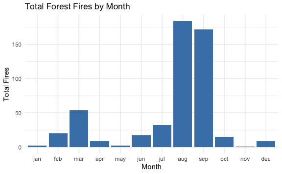
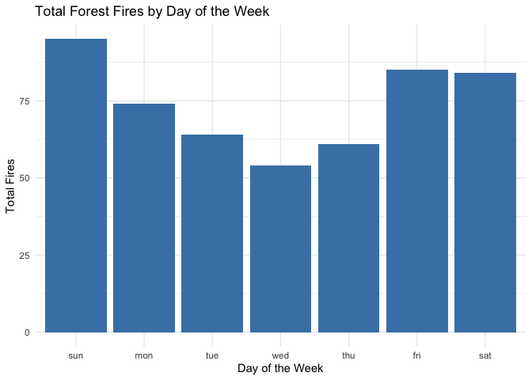
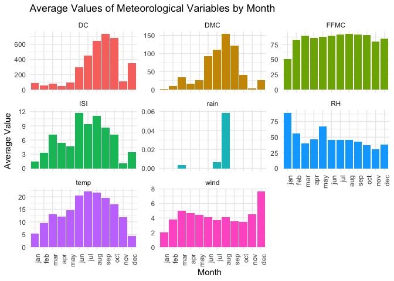
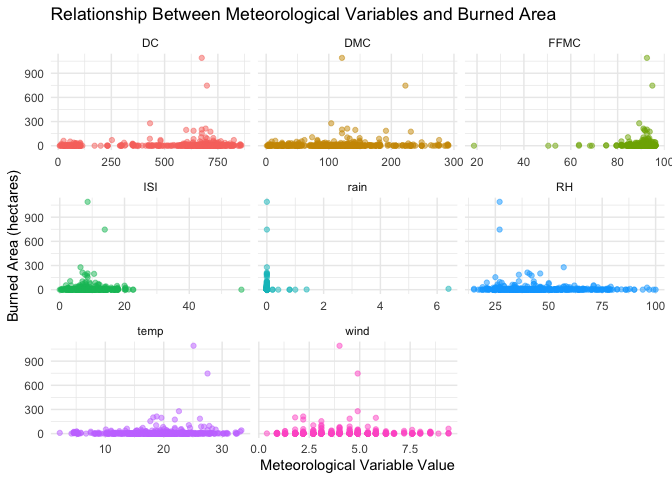
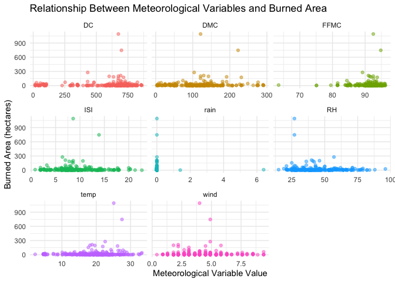
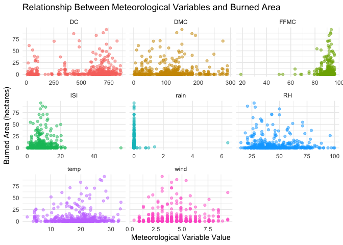
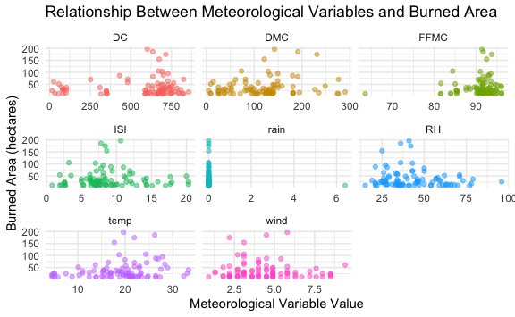

# Guided Project: Analyzing Forest Fire Data


### 2. The Importance of Forest Fire Data

``` r
library(tidyverse)
```

    ── Attaching core tidyverse packages ──────────────────────── tidyverse 2.0.0 ──
    ✔ dplyr     1.1.4     ✔ readr     2.1.5
    ✔ forcats   1.0.0     ✔ stringr   1.5.1
    ✔ ggplot2   3.5.2     ✔ tibble    3.3.0
    ✔ lubridate 1.9.4     ✔ tidyr     1.3.1
    ✔ purrr     1.1.0     
    ── Conflicts ────────────────────────────────────────── tidyverse_conflicts() ──
    ✖ dplyr::filter() masks stats::filter()
    ✖ dplyr::lag()    masks stats::lag()
    ℹ Use the conflicted package (<http://conflicted.r-lib.org/>) to force all conflicts to become errors

``` r
forestfires <- read_csv(
  "forestfires.csv",
  show_col_types = FALSE
)

glimpse(forestfires)
```

    Rows: 517
    Columns: 13
    $ X     <dbl> 7, 7, 7, 8, 8, 8, 8, 8, 8, 7, 7, 7, 6, 6, 6, 6, 5, 8, 6, 6, 6, 5…
    $ Y     <dbl> 5, 4, 4, 6, 6, 6, 6, 6, 6, 5, 5, 5, 5, 5, 5, 5, 5, 5, 4, 4, 4, 4…
    $ month <chr> "mar", "oct", "oct", "mar", "mar", "aug", "aug", "aug", "sep", "…
    $ day   <chr> "fri", "tue", "sat", "fri", "sun", "sun", "mon", "mon", "tue", "…
    $ FFMC  <dbl> 86.2, 90.6, 90.6, 91.7, 89.3, 92.3, 92.3, 91.5, 91.0, 92.5, 92.5…
    $ DMC   <dbl> 26.2, 35.4, 43.7, 33.3, 51.3, 85.3, 88.9, 145.4, 129.5, 88.0, 88…
    $ DC    <dbl> 94.3, 669.1, 686.9, 77.5, 102.2, 488.0, 495.6, 608.2, 692.6, 698…
    $ ISI   <dbl> 5.1, 6.7, 6.7, 9.0, 9.6, 14.7, 8.5, 10.7, 7.0, 7.1, 7.1, 22.6, 0…
    $ temp  <dbl> 8.2, 18.0, 14.6, 8.3, 11.4, 22.2, 24.1, 8.0, 13.1, 22.8, 17.8, 1…
    $ RH    <dbl> 51, 33, 33, 97, 99, 29, 27, 86, 63, 40, 51, 38, 72, 42, 21, 44, …
    $ wind  <dbl> 6.7, 0.9, 1.3, 4.0, 1.8, 5.4, 3.1, 2.2, 5.4, 4.0, 7.2, 4.0, 6.7,…
    $ rain  <dbl> 0.0, 0.0, 0.0, 0.2, 0.0, 0.0, 0.0, 0.0, 0.0, 0.0, 0.0, 0.0, 0.0,…
    $ area  <dbl> 0, 0, 0, 0, 0, 0, 0, 0, 0, 0, 0, 0, 0, 0, 0, 0, 0, 0, 0, 0, 0, 0…

Each row represents a single forest fire, with the following columns:

- **X, Y**: Spatial coordinates within the Montesinho park map (1-9
  scale)
- **month**: Month of the year (jan, feb, mar, …, dec)
- **day**: Day of the week (mon, tue, wed, thu, fri, sat, sun)
- **FFMC**: Fine Fuel Moisture Code - measures moisture content of
  litter and fine fuels. Higher values indicate drier conditions and
  higher fire risk (0-101 scale)
- **DMC**: Duff Moisture Code - measures moisture content of loosely
  compacted decomposing matter. Higher values indicate drier conditions
  in deeper organic layers
- **DC**: Drought Code - measures moisture content in deep, compact
  organic layers. Indicates seasonal drought effect on forest fuels with
  slow drying and wetting
- **ISI**: Initial Spread Index - combines wind speed and FFMC to
  indicate expected rate of fire spread. Higher values indicate faster
  potential fire spread
- **temp**: Outside temperature in Celsius degrees
- **RH**: Outside relative humidity in percentage
- **wind**: Outside wind speed in km/h
- **rain**: Outside rain in mm/m²
- **area**: Burned area of the forest in hectares. Values of 0 indicate
  fires that burned less than 1 hectare

The Fire Weather Index System (FFMC, DMC, DC, ISI) uses meteorological
inputs to assess fire danger. FFMC responds quickly to weather changes,
DMC reflects medium-term drought effects, and DC indicates long-term
drought conditions.

## 3: Data Processing

For the months, we can use the built-in `month.abb` object to ensure
they are ordered correctly, but we have to convert it to lowercase since
our data is all lowercase. For the days of the week, we can use a custom
order from Sunday to Saturday.

``` r
forestfires <- forestfires |>
  mutate(
    month = factor(month, levels = tolower(month.abb), ordered = TRUE),
    day = factor(
      day,
      levels = c("sun", "mon", "tue", "wed", "thu", "fri", "sat"),
      ordered = TRUE
    )
  )

levels(forestfires$month)
```

     [1] "jan" "feb" "mar" "apr" "may" "jun" "jul" "aug" "sep" "oct" "nov" "dec"

``` r
levels(forestfires$day)
```

    [1] "sun" "mon" "tue" "wed" "thu" "fri" "sat"

## 4: When Do Most Forest Fires Occur?

``` r
fires_by_month <- forestfires |>
  group_by(month) |>
  summarise(total_fires = n(), .groups = "drop") |>
  arrange(month)

fires_by_day <- forestfires |>
  group_by(day) |>
  summarise(total_fires = n(), .groups = "drop") |>
  arrange(day)
```

``` r
ggplot(fires_by_month, aes(x = month, y = total_fires)) +
  geom_col(fill = "steelblue") +
  labs(
    title = "Total Forest Fires by Month",
    x = "Month",
    y = "Total Fires"
  ) +
  theme_minimal()
```



``` r
ggplot(fires_by_day, aes(x = day, y = total_fires)) +
  geom_col(fill = "steelblue") +
  labs(
    title = "Total Forest Fires by Day of the Week",
    x = "Day of the Week",
    y = "Total Fires"
  ) +
  theme_minimal()
```



## 5: Plotting Other Variables Against Time

``` r
forestfires_long <- forestfires |>
  pivot_longer(
    cols = c(FFMC, DMC, DC, ISI, temp, RH, wind, rain),
    names_to = "variable",
    values_to = "value"
  )

forestfires_month_long <- forestfires_long |>
  group_by(month, variable) |>
  summarise(
    avg_value = mean(value, na.rm = TRUE),
    .groups = "drop"
  )
```

``` r
ggplot(forestfires_month_long, aes(x = month, y = avg_value, fill = variable)) +
  geom_col() +
  labs(
    title = "Average Values of Meteorological Variables by Month",
    x = "Month",
    y = "Average Value"
  ) +
  theme_minimal() +
  # Adjust the x-axis text for better readability
  theme(axis.text.x = element_text(angle = 90, hjust = 1)) +
  # remove the legend since we are using facets that give the same information
  scale_fill_discrete(guide = "none") +
  facet_wrap(~variable, scales = "free_y")
```



## 6: Examining Forest Fire Severity

``` r
forestfires_long |>
  ggplot(aes(x = value, y = area)) +
  # Using alpha to reduce overplotting
  geom_point(aes(color = variable), alpha = 0.5) +
  facet_wrap(~variable, scales = "free_x") +
  theme_minimal() +
  labs(
    title = "Relationship Between Meteorological Variables and Burned Area",
    x = "Meteorological Variable Value",
    y = "Burned Area (hectares)"
  ) +
  scale_color_discrete(guide = "none")
```



## 7: Outlier Problems

### Remove zero-area fires

``` r
forestfires_long |>
  filter(area > 0) |>
  ggplot(aes(x = value, y = area)) +
  geom_point(aes(color = variable), alpha = 0.5) +
  facet_wrap(~variable, scales = "free_x") +
  theme_minimal() +
  labs(
    title = "Relationship Between Meteorological Variables and Burned Area",
    x = "Meteorological Variable Value",
    y = "Burned Area (hectares)"
  ) +
  scale_color_discrete(guide = "none")
```



### Remove very large fires

``` r
forestfires_long |>
  filter(area < 100) |>
  ggplot(aes(x = value, y = area)) +
  geom_point(aes(color = variable), alpha = 0.5) +
  facet_wrap(~variable, scales = "free_x") +
  theme_minimal() +
  labs(
    title = "Relationship Between Meteorological Variables and Burned Area",
    x = "Meteorological Variable Value",
    y = "Burned Area (hectares)"
  ) +
  scale_color_discrete(guide = "none")
```



### Fires between 10 and 200 ha

This plot illustrates adjusting figure sizing and aspect ratio. The
chunk options are specified as:


    ::: {.cell layout-align="center"}

    ```{.r .cell-code}
    # ggplot code here
    ```
    :::

Because this document renders to Markdown, the `fig.align` option is not
effective. However, it is useful when rendering to HTML or PDF formats.

``` r
forestfires_long |>
  filter(area >= 10, area <= 200) |>
  ggplot(aes(x = value, y = area)) +
  geom_point(aes(color = variable), alpha = 0.5) +
  facet_wrap(~variable, scales = "free_x") +
  theme_minimal() +
  labs(
    title = "Relationship Between Meteorological Variables and Burned Area",
    x = "Meteorological Variable Value",
    y = "Burned Area (hectares)"
  ) +
  scale_color_discrete(guide = "none")
```


